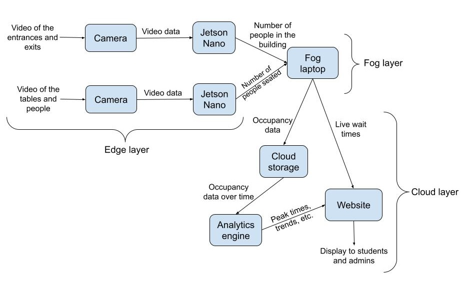
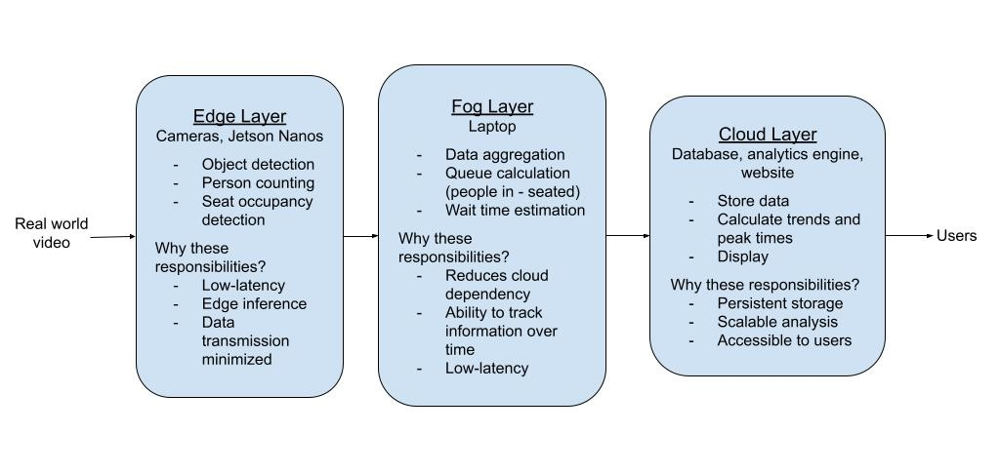

# CS131 Edge Computing Project

## Campus Dining Capacity Tracker

Real-time occupancy monitoring for on-campus dining.

Contributors: [Isaac Ja](https://github.com/IsaacJa75), [Caleb Mak](https://github.com/cmakkkk), [Nada Salib](https://github.com/nadasalib), [Andres Solorio](https://github.com/Andres-55), [Temuulen Tserenchimed](https://github.com/PlatsXD), [Selina Wu](https://github.com/ploscky)

## Overview

On-campus dining venues like The Barn and Coffee Bean currently offer no way to check seat availability before arriving. Students and faculty have no visibility into how busy a restaurant is.

This project brings real-time capacity tracking to campus dining, similar to how UCR already monitors parking lot availability. It monitors entrances, table occupancy, and wait queues using overhead cameras, then sends that data to a live web dashboard.

## Project Structure

```text
.
|-- diagrams/              # System and workload diagrams
|-- src/
|   |-- config.py          # Shared Python runtime settings
|   |-- main.py            # Python dependency/import inventory
|   |-- data/
|   |   `-- dashboard.json # Data served by the dashboard
|   |-- edge_devices/      # Entrance and seat camera edge devices
|   |-- fog/               # Fog server, wait-time logic, and DB helpers
|   `-- web/
|       |-- server.js      # Express dashboard server
|       `-- public/        # Static dashboard HTML, CSS, and JS
|-- package.json           # Node dashboard dependencies and scripts
|-- package-lock.json
|-- requirements.txt       # Python dependencies
`-- README.md
```

## Quick Start

Install Python dependencies:

```bash
pip install -r requirements.txt
```

Install Node dependencies:

```bash
npm install
```

Run the dashboard web server:

```bash
npm start
```

Open `http://localhost:3000`.

Run the fog server:

```bash
python src/fog/fog_server.py
```

Run the edge-device scripts in separate terminals:

```bash
python src/edge_devices/entrance_counter.py
python src/edge_devices/seats.py
```

## Features

- Live occupancy tracking for arrivals, departures, and current headcount.
- Table-level tracking for occupied and open seats.
- Wait time estimates shown on the web dashboard.
- Peak-time analytics support through stored historical data.
- Public dashboard for current and predicted occupancy.

## Task Distribution

### Edge Layer

The edge layer uses two edge devices. One camera tracks people entering and leaving the restaurant. The corresponding Jetson Nano uses a counter that increments when a person enters and decrements when a person leaves.

A second camera checks how many seats and booths are open. Its Jetson Nano detects people and seats to determine whether a seat is occupied. Together, the edge devices track table occupancy and the number of people waiting.

### Fog Layer

The fog layer calculates estimated wait times using area-specific time limits. A laptop acts as the fog computing device, aggregating data captured by the edge devices and writing dashboard updates.

### Cloud Layer

The cloud layer stores long-term occupancy and entrance data. This data can be analyzed to compute peak restaurant traffic and expected occupancy.

## System Design



## Workload Distribution



## Website Draft


## Tool Inventory

| Technology | Purpose |
|---|---|
| 2 Jetson Nanos | Analyze video data: one for people entering/leaving and one for seated occupancy. |
| 2 cameras | Capture video feeds at the entrance/exit and above the room. |
| Laptop | Calculate live wait times, aggregate data, and send information to storage. |

## Acknowledgements

This project is developed as part of UCR's CS131 Edge Computing course taught by Professor Neftali.
